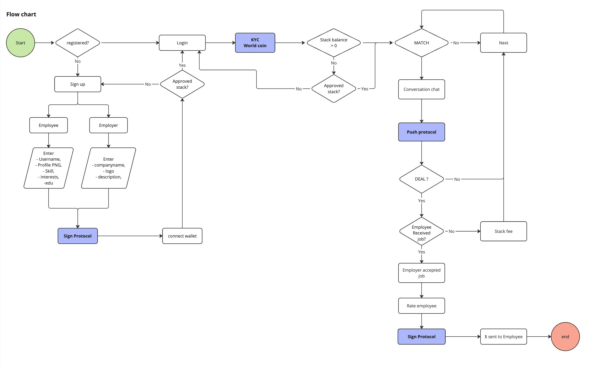

# Trust Me

Built with  

Tinder + Linkedin + Crypto

## Overview
Trust Me is a decentralized protocol that revolutionizes part-time work verification through blockchain-based reputation scoring. It enables trustless verification of temporary workers through an innovative reputation system built on smart contracts.

## How It Works
1. **Reputation Pod Creation**
   - Users create a personal Reputation Pod on the Ethereum network
   - Initial reputation score starts at 0
   - Protocol automatically stakes initial Pod deposit

2. **Building Trust**
   - Reputation grows through verified work completions
   - All interactions are secured by cryptographic signatures (Sign Protocol)
   - Both employers and workers must confirm task completion

3. **Incentive Mechanism**
   - Initial Pod deposit is locked in BitDSM
   - Higher reputation scores unlock the initial deposit

## Key Features
- Decentralized reputation system built on Ethereum and BitDSM
- Economic incentives for honest participation
- Transparent on-chain scoring system
- User-friendly matching interface
- Real-time reputation updates
- Challenge resolution finality for disputes with Pyth randomness
- Chronicle oracle for price feed

## Technical Stack
- Smart Contracts: Solidity
- Frontend: Next.js
- Backend: Node.js
- Blockchain: Ethereum (Holesky Testnet), Bitcoin (Testnet)

## Contract Addresses
Reputation Pod: [0x5E5b22ea2aE899D2E4fD5F27155C59Bb7d05e50C](https://holesky.etherscan.io/address/0x5E5b22ea2aE899D2E4fD5F27155C59Bb7d05e50C)

## Architecture

